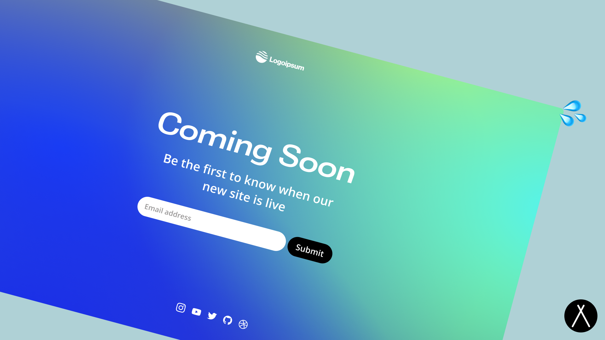

<p align="center">
  
</p>

<br/>
<div align="center">
  <a href="https://twitter.com/littlesticksdev">
  
</a>
  <a href="https://littlesticks.lemonsqueezy.com/checkout/buy/ce15f246-6ffb-417d-b380-0745aeef69a9">
    
  </a>
  <a href="https://littlesticks.dev/discord">
    
  </a>
  
</div>
<br/>

# Cannonball Splash Page 💦

This is a template for a modern splash page/coming soon page inspired by [this Framer template](https://coming-soon.framer.website/).

You can learn more about this template/theme's creation in [this YouTube video](https://www.youtube.com/watch?v=o58kSpPMuuI)

## Features

- ✅ Modern Design
- ✅ Email Signup Form
- ✅ SEO friendly
- ✅ Modern CSS Reset via Andy Bell
- ✅ Fluid typography scaling via Utopia
- ✅ Base and Page Layouts
- ✅ A generic but flexible Button component
- ✅ Automatic Sitemap

## Get Started

Customize the global site settings such as the title and description in the `src/data/settings.ts` file

Set your own social profile links and icons in the `src/data/socials.ts` file

<p>
  <a href="https://stackblitz.com/github/littlesticks/cannonball">
  
  </a>
</p>

OR

## Local Development

```bash
npm i && npm start
```

## Deploy

Astro has [an in-depth guide](https://docs.astro.build/en/guides/deploy/) on how to deploy an Astro project to each service.

## Project Structure

```ts
├── assets/
│   ├── discord-badge.svg
│   ├── gh-banner.png
│   ├── sponsor-badge.svg
│   └── twitter-badge.svg
├── public/
│   ├── assets/
│   │   └── images/
│   │       └── bg.svg
│   └── favicon.png
├── src/
│   ├── components/
│   │   ├── BaseHead.astro
│   │   ├── Button.astro
│   │   ├── Container.astro
│   │   ├── FadeIn.astro
│   │   ├── Footer.astro
│   │   ├── Header.astro
│   │   ├── Logo.astro
│   │   └── SignupForm.astro
│   ├── data/
│   │   ├── settings.ts
│   │   └── socials.ts
│   ├── icons/
│   │   └── placeholder-logo.svg
│   ├── layouts/
│   │   ├── Base.astro
│   │   └── Page.astro
│   ├── pages/
│   │   └── index.astro
│   ├── styles/
│   │   ├── main.css
│   │   └── reset.css
│   └── env.d.ts
├── astro.config.mjs
├── LICENSE
├── package-lock.json
├── package.json
├── README.md
├── sandbox.config.json
└── tsconfig.json
```

## Sponsor

If you find this theme useful, please consider donating to support the continued development of it with the link below

[Donate to Little Sticks](https://littlesticks.lemonsqueezy.com/checkout/buy/ce15f246-6ffb-417d-b380-0745aeef69a9)

## Support

Please feel free to reach out to us on our Discord if you have questions or file an issue on the repo.

[Join our Discord](https://littlesticks.dev/discord)
