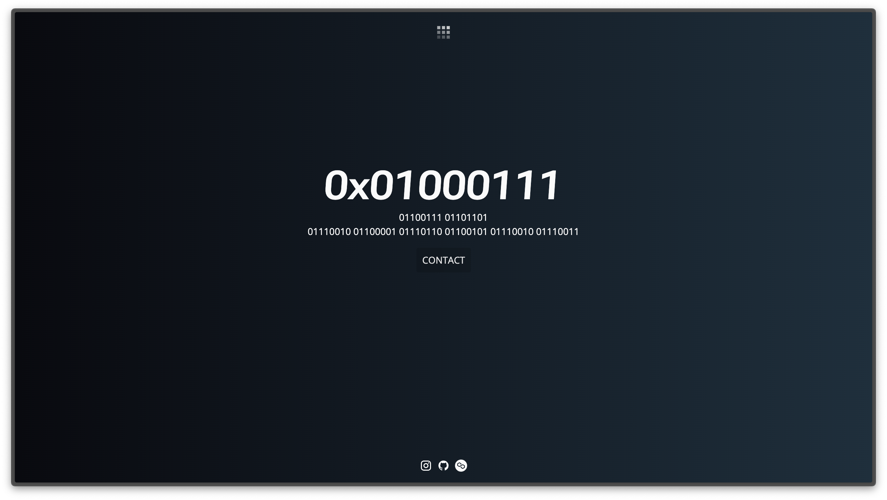
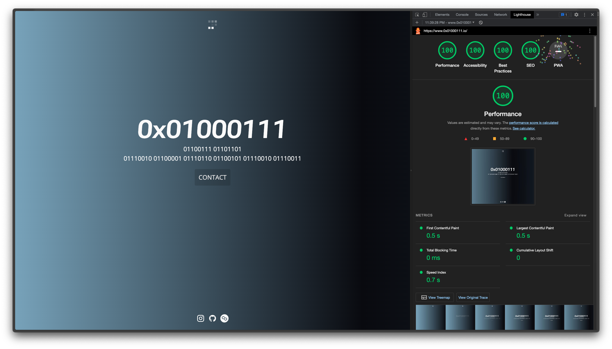

# 0x01000111's Landing Page



## Lighthouse Scores



- 🟢 Performance: 100
- 🟢 Accessibility: 100
- 🟢 Best Practices: 100
- 🟢 SEO: 100
- ⚫️ Progressive Web App: N/A

## Site

View a live site of the [0x01000111's Landing Page](http://www.0x01000111.io/) .

## Tech Stack

- [Astro](https://astro.build)
- [SCSS](https://sass-lang.com/)
- [TypeScript](https://www.typescriptlang.org/)
- [Vite](https://vitejs.dev/guide/)

## Project Structure

```ts
├── assets/
│   ├── discord-badge.svg
│   ├── gh-banner.png
│   ├── sponsor-badge.svg
│   └── twitter-badge.svg
├── public/
│   ├── Banner-0x01000111_Landing.Page_Lighthouse.png
│   └── Banner-0x01000111_Landing.Page.png
├── src/
│   ├── components/
│   │   ├── BaseHead.astro
│   │   ├── Button.astro
│   │   ├── Contact.astro
│   │   ├── Container.astro
│   │   ├── FadeIn.astro
│   │   ├── Footer.astro
│   │   ├── Header.astro
│   │   └── Logo.astro
│   ├── data/
│   │   ├── settings.ts
│   │   └── socials.ts
│   ├── icons/
│   │   └── placeholder-logo.svg
│   ├── layouts/
│   │   ├── Base.astro
│   │   └── Page.astro
│   ├── pages/
│   │   └── index.astro
│   ├── styles/
│   │   ├── main.scss
│   │   └── reset.scss
│   └── env.d.ts
├── astro.config.mjs
├── LICENSE
├── package-lock.json
├── package.json
├── README.md
├── sandbox.config.json
└── tsconfig.json
```

## Running Locally

```bash
> npm i

> npm run dev
```

## Deployment

This project is deployed on Vercel with a custom domain.

> - [Friendly guide](https://gist.github.com/khushal87/81b7b74c4e5324b2ff29bbc51f059513) from [khushal87](https://gist.github.com/khushal87) on how to link a custom domain from Google domains to Vercel.

> - [Official guide](https://vercel.com/docs/concepts/projects/domains/add-a-domain) from Vercel on "Adding & Configuring a Custom Domain".

> - [In-depth guide](https://docs.astro.build/en/guides/deploy/) from Astro on how to deploy to each service.

## Components

The global site settings can be customized in `src/data/settings.ts`.

```ts
export const settings = {
  site: "https://astro-0x01000111-landing-page.vercel.app/",
  name: "0x01000111",
  title: "0x01000111 | Landing Page",
  description: "0x01000111 | Landing Page",
};
```

---

The social profile links can be be customized in `src/data/socials.ts`.

```ts
export const socials = [
  {
    title: "Instagram",
    icon: "mdi:instagram",
    url: "https://www.instagram.com/0x01000111/",
    label: "Follow us on Instagram",
  },
  {
    title: "GitHub",
    icon: "mdi:github",
    url: "https://github.com/GrungeElFz/Astro_0x01000111_Landing.Page",
    label: "Visit our GitHub repository",
  },
  {
    title: "Opensea",
    icon: "cryptocurrency:matic",
    url: "https://opensea.io/assets/matic/0x99b59ed222f9d228fb96ba54541731e8c6f1df64/1037/",
    label: "Explore our Opensea collection",
  },
];
```

---

Site metadata can be configured in `src/components/BaseHead.astro`.

```ts
import { settings } from "../data/settings";

// ...

const title = Astro.props.title || settings.title;
const description = Astro.props.description || settings.description;
const canonicalURL = Astro.props.canonicalURL || new URL(Astro.url.pathname, Astro.site);
const image = new URL(Astro.props.image || "/Banner-0x01000111_Landing.Page.png", Astro.site);

// settingsmap
<link rel="sitemap" href="/sitemap.xml" />

// Canonical
<link rel="canonical" href={canonicalURL} />

// Primary Meta Tags
<title>{title || settings.title}</title>
<meta name="title" content={title || settings.title} />
<meta name="description" content={description || settings.description} />
<meta name="generator" content={Astro.generator} />

// Open Graph / Facebook
<meta property="og:type" content="website" />
<meta property="og:url" content={canonicalURL} />
<meta property="og:title" content={title} />
<meta property="og:description" content={description} />
<meta property="og:image" content={image} />

// Twitter
<meta property="twitter:card" content="summary_large_image" />
<meta property="twitter:url" content={canonicalURL} />
<meta property="twitter:title" content={title} />
<meta property="twitter:description" content={description} />
<meta property="twitter:image" content={image} />

// ..
```

Fonts can also be customzied in the same `BaseHead.astro` component.

```ts
// Google Fonts

<link rel="preconnect" href="https://fonts.googleapis.com" />
<link rel="preconnect" href="https://fonts.gstatic.com" crossorigin />
<link
  rel="preload"
  href="https://fonts.googleapis.com/icon?family=Material+Icons"
  as="style"
  onload="this.onload=null;this.rel='stylesheet'"
/>
<noscript>
  <link
    href="https://fonts.googleapis.com/icon?family=Material+Icons"
    rel="stylesheet"
    type="text/css"
  />
</noscript>

<link
  rel="preload"
  href="https://fonts.googleapis.com/css2?family=Roboto+Flex:opsz,slnt,wdth,wght@8..144,-4,40,600;8..144,-4,59.1,600;8..144,-4,125,600&family=Open+Sans&display=swap"
  as="style"
  onload="this.onload=null;this.rel='stylesheet'"
/>
<noscript>
  <link
    href="https://fonts.googleapis.com/css2?family=Roboto+Flex:opsz,slnt,wdth,wght@8..144,-4,40,600;8..144,-4,59.1,600;8..144,-4,125,600&family=Open+Sans&display=swap"
    rel="stylesheet"
    type="text/css"
  />
</noscript>
```

---

The `Fade In` transition function is in `src/components/FadeIn.astro`.

It can be applied _globally_ to any element, by adding a class `fade-in`.

> For example:

```html
<h1 class="fade-in">0x01000111</h1>
<p class="fade-in">01100111 01101101</p>
<p class="fade-in description">
  01110010 01100001 01110110 01100101 01110010 01110011
</p>
```

## Support

[Template Repository ](https://github.com/littlesticks/cannonball)
• [Little Sticks - Discord](https://littlesticks.dev/discord)
• [Donate to Little Sticks](https://littlesticks.lemonsqueezy.com/checkout/buy/ce15f246-6ffb-417d-b380-0745aeef69a9)
